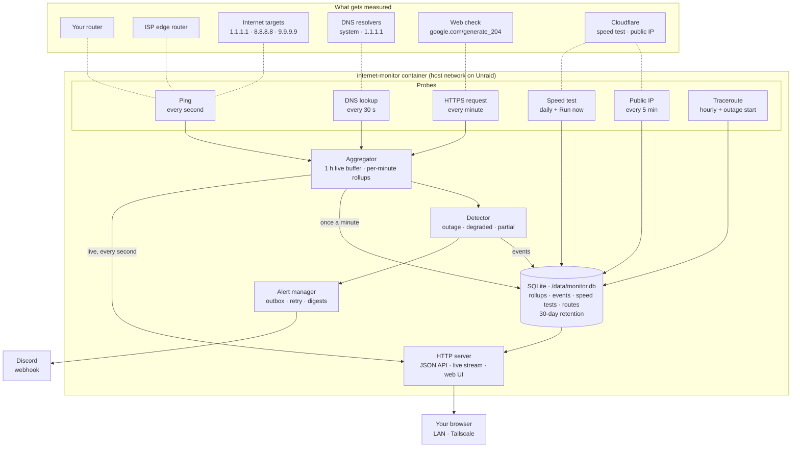
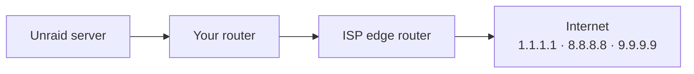

# Unraid Internet Monitor

A lightweight Docker app for Unraid that continuously measures the quality of your
internet connection. It tracks latency, jitter, packet loss, outages, DNS and web
response times, and daily speed. It keeps 30 days of history, sends Discord alerts,
and serves a web UI you can reach on your LAN and over Tailscale.

The design and milestone history are in [docs/PLAN.md](docs/PLAN.md).

**What it does**

- Pings your router, your ISP's edge router and three public resolvers **once a
  second**.
- Times a DNS lookup every 30 s and a fresh HTTPS request every minute (split
  into DNS, connect, TLS and server time), and tracks your public IP address.
- Runs a **daily speed test** (plus on demand) that also measures how much
  latency rises while the line is full, and grades the bufferbloat.
- Detects **outages**, and says whether the break is your LAN, your ISP's
  connection or further upstream. It also detects slowdowns, and DNS or web
  failures while ping still works. When an outage starts, it records the route so
  you can see where packets stopped.

The web UI has five pages:

- **Dashboard:** live state, uptime, latency, loss, call quality (MOS), last speed
  test, a live 15-minute chart, per-target stats, DNS and web checks, and recent
  events.
- **History:** 1 hour to 30 days of latency, packet loss, jitter and DNS/web
  response time. Outages, slowdowns and speed tests are shaded. Drag to zoom, pick
  one target for its median/p95 band, or switch to a table.
- **Events:** every outage, slowdown and change, with uptime totals and the
  route recorded when each outage started.
- **Speed:** results over time, latency under load, a **Run now** button and a
  results table.
- **Settings:** the discovered route, the configuration and a Discord test button.

The UI follows your light or dark theme and works on a phone. It is served from
the container itself, so it keeps working while your internet is down.

## How it works



- **Probes** run on their own schedules. Ping uses a single raw ICMP socket, opened
  as root before the app drops to `99:100`. It sends one burst per second to every
  target and matches replies by sequence number. The web and speed checks never use
  a proxy, because the point is to measure this connection.
- **Aggregator** keeps the last hour per second in memory for the live chart. It
  rolls results up into per-minute min/avg/p50/p95/p99/max, jitter and loss, which
  are written to SQLite in one transaction a minute.
- **Detector** is a pure state machine over each second's results. It opens and
  closes outage, degraded and single-target events. Events, speed tests, routes and
  public-IP changes are stored next to the rollups, and anything older than the
  retention period is pruned hourly.
- **Alert manager** turns events into Discord messages through a persistent
  outbox. An alert raised while the internet is down is delivered (or replaced by
  the recovery message) once it comes back.
- **HTTP server** serves the JSON API, a server-sent-events stream for the live
  chart, and the dashboard. The dashboard is plain JavaScript with uPlot, embedded
  in the binary.

### How outages are classified



An outage starts when **every** internet target has been silent for 3 seconds. The
monitor then looks at the hops in between for the rest of the outage:

| Router | ISP edge | Likely cause shown |
|---|---|---|
| silent | – | **Your router or LAN** (router, modem, cabling, power) |
| answers | silent | **Your ISP's connection** |
| answers | answers | **ISP network or beyond** |

Only one or two internet targets failing is recorded as a *target unreachable*
event, not an outage. DNS or web checks failing three times in a row while ping
still works get their own *DNS failing* / *Web check failing* events.

### Speed tests

The daily test (04:00 local time plus a random 0–10 min delay, or on demand) runs
against Cloudflare's speed test service. Each direction uses 6 parallel connections
for 10 seconds, and the first 2 seconds are ignored so TCP slow start doesn't drag
the number down. Upload is counted from bytes the server has **acknowledged**
(Linux `TCP_INFO`), not bytes handed to the socket, which would overstate it.

While each direction runs, the monitor pings 1.1.1.1 five times a second and compares
the result with the idle latency measured just before. The increase gives the
**bufferbloat grade**: A+ (< 5 ms), A (< 30), B (< 60), C (< 200), D (< 400), F.
A daily test on a 1 Gbps line uses about 2.5 GB (≈ 75 GB a month). The data used
is recorded with each result.

## Install on Unraid

The image is built by GitHub Actions and published to
`ghcr.io/thedatafiend/unraid-internet-monitor` for amd64 and arm64.

1. **If you started it by hand before**, remove that container first. Your
   history in `appdata` is kept:
   ```sh
   docker rm -f internet-monitor
   ```
2. **Add the template** from an Unraid terminal:
   ```sh
   wget -O /boot/config/plugins/dockerMan/templates-user/my-internet-monitor.xml \
     https://raw.githubusercontent.com/thedatafiend/unraid-internet-monitor/HEAD/unraid/internet-monitor.xml
   ```
3. **Create the container:** go to **Docker → Add Container**, pick **internet-monitor** from
   the *Template* list (under *User templates*), paste your Discord webhook URL if you
   want alerts, and click **Apply**. The defaults (host networking, data in
   `/mnt/user/appdata/internet-monitor`, port 8765) suit most setups. Tuning options are
   under *Show more settings*.
4. **Open the UI** from the container's icon (**WebUI**), or go to `http://<unraid-ip>:8765`.
   Because the Unraid host is on your tailnet, it's also at
   `http://<unraid-tailscale-name>:8765`.

**Updating:** on the Docker tab, click **Check for Updates**, then **apply update**.

Keep the `appdata` share on the cache/SSD pool. The app writes about once a minute,
which would otherwise keep array disks spinning.

### Image tags

| Tag | What it is |
|---|---|
| `latest` | The repository's default branch |
| `1.2.3`, `1.2` | Release tags (`v1.2.3`) |
| `sha-abc1234` | A specific commit |
| `<branch-name>` | The tip of any other branch |

### Checking the setup

`diag` prints what the monitor sees: socket type, privilege drop, egress route,
gateway, ISP edge router, a traceroute and a 10-ping test to every target.

```sh
docker run --rm --network host ghcr.io/thedatafiend/unraid-internet-monitor diag
```

Look for `ICMP socket v4: raw`, `uid/gid after drop: 99/100`, your LAN interface
and `tunnel in path: none`, your router as the gateway, and 0% loss to the
internet targets. If `ISP hop:` says `none`, your ISP filters those probes; set
`ISP_HOP=off`.

## Discord alerts

1. In Discord, open the channel's **Edit Channel → Integrations → Webhooks → New
   Webhook**, then **Copy Webhook URL**.
2. Pass it to the container as `-e DISCORD_WEBHOOK_URL=https://discord.com/api/webhooks/...`.
   Treat the URL like a password: anyone who has it can post to the channel.
3. Open the status page and click **Send test alert**, or run
   `curl -X POST http://<unraid-ip>:8765/api/alerts/test`.

What you get:

- **Outage:** after 30 s, and again on recovery with the duration, the likely
  cause, and the last router that answered when it started. When the whole internet is down, Discord is unreachable too, so you get
  a single "restored" message once the connection is back.
- **Degraded:** loss of at least 2%, or p95 latency over 100 ms, sustained for 2
  minutes. You get a message when it starts and when it clears.
- **Flapping:** several outages in quick succession are batched into one digest
  instead of a burst of messages.
- **Public IP change:** the old and new address (turn off with `ALERT_IP_CHANGE=false`).
- **Slow speed test:** when a result is below `ALERT_MIN_DOWN_MBPS` / `ALERT_MIN_UP_MBPS` (off by default).

## Configuration

All settings are environment variables. The full list, including the ones planned
for later milestones, is in [section 7 of the plan](docs/PLAN.md#7-configuration).

| Variable | Default | |
|---|---|---|
| `LISTEN_ADDR` | `:8765` | Web UI/API address |
| `DATA_DIR` | `/data` | SQLite database directory |
| `RETENTION_DAYS` | `30` | |
| `PING_TARGETS` | `1.1.1.1,8.8.8.8,9.9.9.9` | Internet targets (IPs or hostnames) |
| `PING_TARGETS_V6` | `2606:4700:4700::1111,2001:4860:4860::8888,2620:fe::fe` | Used only when IPv6 is available |
| `IPV6` | `auto` | `auto`, `on` or `off` |
| `GATEWAY` | `auto` | `auto`, `off`, or your router's IP |
| `ISP_HOP` | `auto` | `auto`, `off`, or an IP |
| `CUSTOM_TARGETS` | unset | `name=host,name2=host2`, charted but never counted as an outage |
| `PING_INTERVAL` / `PING_TIMEOUT` | `1s` / `2s` | |
| `PUID` / `PGID` | `99` / `100` | User the app switches to after opening its ICMP socket. `PUID=0` stays root |
| `OUTAGE_THRESHOLD` | `3s` | All internet targets down this long counts as an outage |
| `DEGRADED_LOSS_PCT` / `DEGRADED_P95_MS` / `DEGRADED_MIN` | `2` / `100` / `2m` | Degraded-connection thresholds |
| `DISCORD_WEBHOOK_URL` | unset | Turns on alerts |
| `ALERT_MIN_OUTAGE` | `30s` | Shorter outages are recorded but not alerted |
| `ALERT_COALESCE` | `5m` | Window for batching repeated alerts into a digest |
| `ALERT_ISP_HOP_CHANGE` | `false` | Alert when your ISP's edge router changes |
| `ALERT_IP_CHANGE` | `true` | Alert when your public IP changes |
| `DNS_SERVERS` | `system,1.1.1.1` | Resolvers to time; `system` is the one in `/etc/resolv.conf`; `off` disables |
| `DNS_QUERY` / `DNS_INTERVAL` | `www.google.com` / `30s` | |
| `HTTP_TARGETS` | `https://www.google.com/generate_204` | URLs fetched over a fresh connection; `off` disables |
| `HTTP_INTERVAL` / `HTTP_TIMEOUT` | `1m` / `10s` | |
| `PUBLIC_IP_INTERVAL` | `5m` | `0` disables |
| `SPEEDTEST_SCHEDULE` | `04:00` | Daily time (local, 24-hour) or `off` for manual tests only. Set `TZ` (Unraid does this for you) |
| `SPEEDTEST_DURATION` / `SPEEDTEST_STREAMS` | `10s` / `6` | Per direction |
| `SPEEDTEST_URL` | `https://speed.cloudflare.com` | Any server with Cloudflare's `__down` / `__up` API |
| `ALERT_MIN_DOWN_MBPS` / `ALERT_MIN_UP_MBPS` | `0` (off) | Alert when a speed test is slower |

## API

| Endpoint | |
|---|---|
| `GET /api/status` | State (`online`/`degraded`/`outage`) and since when, open events, 24 h uptime, MOS, per-target 60 s stats, DNS/web checks, public IP, last and next speed test, discovery info and warnings |
| `GET /api/events?from=&to=&kind=` | Outages, partial failures, degradations and ISP-hop changes (default: last 7 days) |
| `GET /api/uptime?from=&to=` | Uptime %, downtime, outage count and longest outage (default: last 24 h) |
| `POST /api/alerts/test` | Send a test Discord message |
| `GET /api/targets` | All targets, including disabled ones that still have history |
| `GET /api/metrics?target=ID&from=&to=&step=` | Stored per-minute history as parallel arrays, downsampled to at most 1000 points |
| `GET /api/live?seconds=900` | Per-second RTTs from memory (up to 1 h) |
| `GET /api/traces?event_id=` | Traceroutes: the one taken when an outage started, or recent ones |
| `GET /api/public-ip` | Public IP history (newest first) |
| `GET /api/http?target=ID` | Web-check phase timings (DNS, connect, TLS, server) |
| `GET /api/speedtests` | Speed test results (newest first) |
| `POST /api/speedtest` | Start a speed test (409 if one is already running) |
| `GET /api/speedtest/progress` | Phase and live throughput of a running test |
| `GET /api/stream` | Server-sent events: one message per second with every target's RTT and the current state |
| `GET /api/config` | Effective settings (the webhook URL is reported only as set or unset) |
| `GET /healthz` | 200 once probes are running. Used by the Docker healthcheck |

## Development

```sh
go test ./...
go build ./cmd/internet-monitor
sudo ./internet-monitor diag     # raw ICMP needs root or CAP_NET_RAW
docker build -t internet-monitor .
```

CI (`.github/workflows/ci.yml`) checks formatting, runs `go vet` and the tests
with the race detector, and then builds and pushes the multi-arch image. Pull
requests only run the checks. To cut a release, push a tag such as `v1.0.0`.

The first publish creates the GHCR package as **private**. Make it public once
(**Package settings → Change visibility → Public**) so Unraid can pull it without
credentials.

Without root, the app falls back to unprivileged ping sockets when the host
allows them (`net.ipv4.ping_group_range`). In that mode ISP-hop auto-detection is
unavailable.
